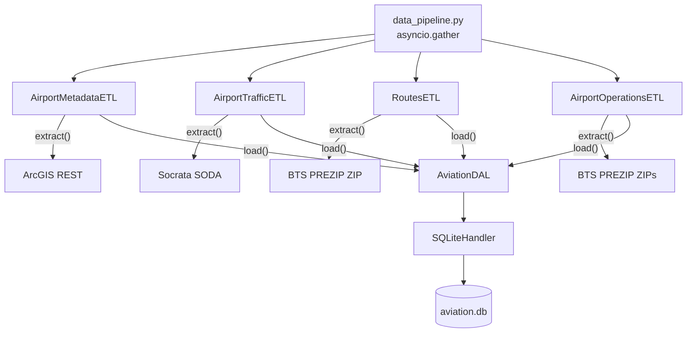
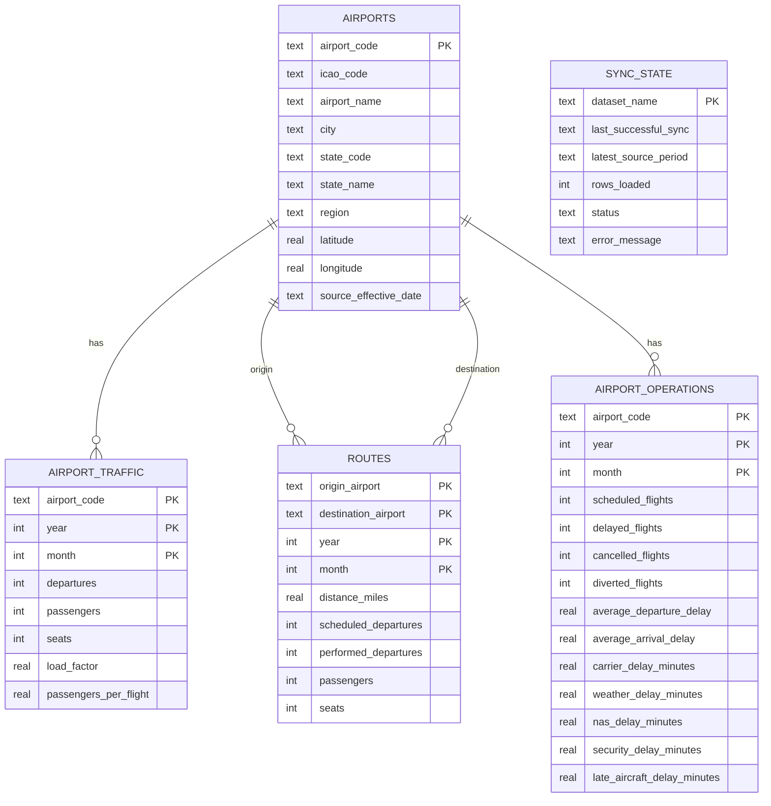
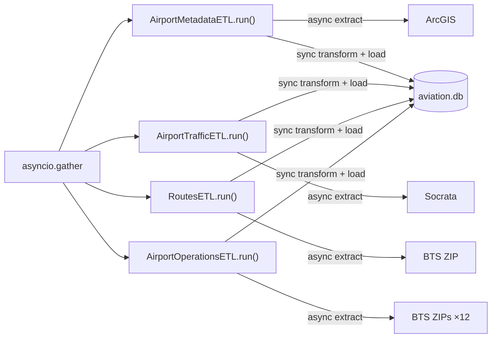

# Aviation Data Ingestion and Storage Architecture

## 1. Purpose

This document describes the data-ingestion and local-storage layer for the Airport Investment Intelligence Agent.

The layer consists of:

- Four source-specific ETL objects, each fully responsible for its own data source.
- One DAL containing aviation-oriented database operations.
- One low-level SQLite handler.
- One pipeline that coordinates the four ETL objects.
- No vector database, ORM, message queue, ETL framework, or class hierarchy.

The chat agent and scoring logic will be built on top of this layer and are outside the scope of this document.

## 2. Code structure

```text
data_pipeline/
├── config.py
├── data_pipeline.py
├── dal/
│   └── aviation_dal.py
├── data_handlers/
│   └── sqlite_handler.py
└── etls/
    ├── airport_metadata_etl.py
    ├── airport_traffic_etl.py
    ├── routes_etl.py
    └── airport_operations_etl.py

storage/
└── aviation.db
```

Run directly:

```text
python -m data_pipeline.data_pipeline
```

## 3. Component responsibilities

### `data_pipeline.py`

Creates the four ETL objects and runs them concurrently:

```python
async with httpx.AsyncClient(timeout=timeout) as client:
    etls = [
        AirportMetadataETL(dal, client),
        AirportTrafficETL(dal, client),
        RoutesETL(dal, client),
        AirportOperationsETL(dal, client),
    ]
    await asyncio.gather(*[etl.run() for etl in etls])
```

It contains no source-specific request logic, no transformation logic, and no refresh-check logic. Those live entirely inside each ETL object.

### ETL objects

Each ETL exposes four methods and owns everything related to its data source:

| Method | Responsibility |
|---|---|
| `extract()` | Makes the HTTP request(s), handles pagination, returns raw records |
| `transform()` | Renames fields, converts types, aggregates rows, rejects invalid values |
| `load()` | Calls the appropriate `AviationDAL` upsert method, returns row count |
| `run()` | Checks `needs_refresh`, orchestrates extract → transform → load, updates `sync_state` |

`run()` catches all exceptions. On success it calls `update_sync_state(status="success", rows_loaded=count)`. On failure it calls `update_sync_state(status="error", error_message=...)` and does not roll back previously committed rows.

### `AviationDAL`

Knows the database schema and exposes domain-level operations. Does not make HTTP requests.

- `upsert_airports(rows)` — `INSERT ... ON CONFLICT DO UPDATE SET` on `airports`
- `upsert_traffic(rows)` — same pattern on `airport_traffic`
- `upsert_routes(rows)` — same pattern on `routes`
- `upsert_operations(rows)` — same pattern on `airport_operations`
- `update_sync_state(dataset_name, *, status, rows_loaded, error_message)` — upserts a `sync_state` row; uses `COALESCE` so an error call never clears `last_successful_sync`
- `get_sync_state(dataset_name)` — returns the current `sync_state` row or `None`
- `needs_refresh(dataset_name, max_age_hours)` — returns `True` when no successful sync exists or the last sync exceeds `max_age_hours`

### `SQLiteHandler`

Manages connections and SQL execution. Contains no aviation or BTS concepts.

- Initialises the schema (all five tables) on construction via `CREATE TABLE IF NOT EXISTS`
- `_connect()` context manager: commits on success, rolls back on exception, always closes
- `execute(sql, params)` — single statement
- `executemany(sql, params) -> int` — batch upsert, returns row count
- `fetchall(sql, params)` and `fetchone(sql, params)`

### `config.py`

Central location for tunable constants:

| Name | Value | Meaning |
|---|---|---|
| `DB_PATH` | `storage/aviation.db` | Default database path |
| `REFRESH_HOURS["airport_metadata"]` | 168 h (7 days) | Max age before re-fetch |
| `REFRESH_HOURS["airport_traffic"]` | 24 h | Max age before re-fetch |
| `REFRESH_HOURS["routes"]` | 24 h | Max age before re-fetch |
| `REFRESH_HOURS["airport_operations"]` | 24 h | Max age before re-fetch |
| `TRAFFIC_MONTHS_WINDOW` | 36 | Months of traffic history requested |
| `OPERATIONS_MONTHS_WINDOW` | 12 | Months of on-time performance history |
| `LONG_HAUL_MILES` | 2 500.0 | Min distance to count as long-haul (Anchorage queries) |



## 4. Data sources

### 4.1 Airport metadata — `AirportMetadataETL`

**Provider:** USDOT/BTS National Transportation Atlas Database (FAA NASR data).

**API:** ArcGIS REST Feature Service, anonymous and read-only.

**Endpoint:**

```text
https://services.arcgis.com/xOi1kZaI0eWDREZv/arcgis/rest/services/NTAD_Aviation_Facilities/FeatureServer/0/query
```

**Fixed query parameters:**

```text
where=COUNTRY_CODE='US'
outFields=ARPT_ID,ICAO_ID,ARPT_NAME,CITY,STATE_CODE,STATE_NAME,LAT_DECIMAL,LONG_DECIMAL,EFF_DATE
returnGeometry=false
f=json
resultRecordCount=1000
```

**Pagination:** The service may return `exceededTransferLimit: true`. The extractor increments `resultOffset` by `PAGE_SIZE` (1 000) until a page is smaller than `PAGE_SIZE` or `exceededTransferLimit` is absent or false.

**Field mapping:**

| Source field | Local field | Notes |
|---|---|---|
| `ARPT_ID` | `airport_code` | Required; row skipped if blank |
| `ICAO_ID` | `icao_code` | Stored as `NULL` if blank |
| `ARPT_NAME` | `airport_name` | |
| `CITY` | `city` | |
| `STATE_CODE` | `state_code` | |
| `STATE_NAME` | `state_name` | |
| `LAT_DECIMAL` | `latitude` | |
| `LONG_DECIMAL` | `longitude` | |
| `EFF_DATE` | `source_effective_date` | |
| *(derived)* | `region` | `"New England"` when state is CT, ME, MA, NH, RI, or VT; otherwise `NULL` |

### 4.2 Airport traffic and capacity — `AirportTrafficETL`

**Provider:** USDOT Bureau of Transportation Statistics.

**Dataset:** AFF — T-100 Segment Summary By Origin Airport.

**API:** Socrata SODA REST API, no key required.

**Endpoint:**

```text
https://data.bts.gov/resource/r495-tyji.json
```

**Query parameters (SoQL):**

```text
$select=origin_airport_code,year,reporting_month,total_departures,
        total_passengers,total_seats,total_load_factor,total_passengers_flight
$where=reporting_month >= '<36 months ago>'
$order=reporting_month ASC
$limit=50000
$offset=<incremented per page>
```

**Pagination:** Pages of 50 000; stops when a batch is smaller than the page size.

**Validation (rows failing any check are dropped):**

- `passengers` must not be negative
- `seats` must not be negative
- `load_factor` must be in `[0, 100]`

**Field mapping:**

| Source field | Local field |
|---|---|
| `origin_airport_code` | `airport_code` |
| `year` / `reporting_month[:4]` | `year` |
| `reporting_month[5:7]` | `month` |
| `total_departures` | `departures` |
| `total_passengers` | `passengers` |
| `total_seats` | `seats` |
| `total_load_factor` | `load_factor` |
| `total_passengers_flight` | `passengers_per_flight` |

### 4.3 Origin-destination routes — `RoutesETL`

**Provider:** USDOT Bureau of Transportation Statistics, TranStats.

**Dataset:** T-100 Segment — All Carriers, annual file.

**Access:** BTS PREZIP bulk download (ZIP containing one CSV). The URL pattern is stable but not formally documented by BTS:

    https://transtats.bts.gov/PREZIP/T_T100_SEGMENT_ALL_CARRIER_{YEAR}.zip

**Window:** The previous complete calendar year (`date.today().year - 1`). One ZIP is downloaded per pipeline run.

**Filter:** Only rows with `CLASS = 'F'` (scheduled passenger service) are retained.

**Aggregation:** Rows are summed across carriers and aircraft types into one row per `(ORIGIN, DEST, YEAR, MONTH)`.

**Field mapping:**

| Source field | Local field |
|---|---|
| `ORIGIN` | `origin_airport` |
| `DEST` | `destination_airport` |
| `YEAR` | `year` |
| `MONTH` | `month` |
| `DISTANCE` | `distance_miles` |
| `DEPARTURES_SCHEDULED` | `scheduled_departures` |
| `DEPARTURES_PERFORMED` | `performed_departures` |
| `PASSENGERS` | `passengers` |
| `SEATS` | `seats` |

**Long-haul definition:** `distance_miles >= LONG_HAUL_MILES` (2 500 miles). This is a documented assumption, not an official BTS classification.

### 4.4 Delays and cancellations — `AirportOperationsETL`

**Provider:** USDOT Bureau of Transportation Statistics, TranStats.

**Dataset:** Marketing Carrier On-Time Performance (Beginning January 2018).

**Access:** BTS PREZIP monthly bulk downloads. URL pattern (where `M` has no leading zero):

    https://transtats.bts.gov/PREZIP/On_Time_Marketing_Carrier_On_Time_Performance_(Beginning_January_2018)_{YYYY}_{M}.zip

**Window:** The 12 most recent complete calendar months (ending with the month before the current calendar month, i.e. excluding the in-progress month). One ZIP is downloaded per month, 12 total per pipeline run.

**Aggregation:** Individual flight rows are aggregated into one row per `(ORIGIN, YEAR, MONTH)`. A flight is counted as delayed when `DEP_DELAY > 15` minutes (BTS standard threshold). Cancelled flights are excluded from delay averages.

**Field mapping (source → aggregated local field):**

| Source field | Aggregated local field |
|---|---|
| `ORIGIN` | `airport_code` |
| `YEAR` | `year` |
| `MONTH` | `month` |
| count of rows | `scheduled_flights` |
| count where `CANCELLED = 1` | `cancelled_flights` |
| count where `DIVERTED = 1` | `diverted_flights` |
| count where `DEP_DELAY > 15` (non-cancelled) | `delayed_flights` |
| mean `DEP_DELAY` (non-cancelled) | `average_departure_delay` |
| mean `ARR_DELAY` (non-cancelled) | `average_arrival_delay` |
| sum `CARRIER_DELAY` | `carrier_delay_minutes` |
| sum `WEATHER_DELAY` | `weather_delay_minutes` |
| sum `NAS_DELAY` | `nas_delay_minutes` |
| sum `SECURITY_DELAY` | `security_delay_minutes` |
| sum `LATE_AIRCRAFT_DELAY` | `late_aircraft_delay_minutes` |

**Scope limitation:** Covers domestic scheduled passenger flights reported by marketing carriers only. International flights, charter services, and general aviation are excluded. This must be disclosed when presenting congestion or unmet-demand indicators.

## 5. SQLite schema



### `airports`

One row per airport. Primary key is `airport_code`.

### `airport_traffic`

One row per `(airport_code, year, month)`. Source publishes one row per airport per reporting month; no client-side aggregation is needed.

### `routes`

One row per `(origin_airport, destination_airport, year, month)`, aggregated from individual carrier/aircraft-type rows in the T-100 file.

### `airport_operations`

One row per `(airport_code, year, month)`, aggregated from individual flight rows in the on-time performance file.

### `sync_state`

One row per dataset (`airport_metadata`, `airport_traffic`, `routes`, `airport_operations`):

| Column | Meaning |
|---|---|
| `dataset_name` | Primary key |
| `last_successful_sync` | UTC ISO timestamp of the last successful `run()` |
| `latest_source_period` | Newest period published by the provider (not currently populated) |
| `rows_loaded` | Row count from the last successful load |
| `status` | `"success"` or `"error"` |
| `error_message` | Exception string on failure; `NULL` on success |

`update_sync_state` uses `COALESCE` on `last_successful_sync`, `latest_source_period`, and `rows_loaded`, so an error call never clears a previously recorded successful timestamp or count.

## 6. Async extraction and sequential writes



The four `run()` coroutines are launched concurrently with `asyncio.gather`. Inside each coroutine, `transform()` and `load()` are synchronous — asyncio cannot interleave them with other coroutines while they execute. This naturally serialises SQLite writes without explicit locking.

## 7. Refresh and failure strategy

Each `run()` call follows this sequence:

1. Call `needs_refresh(dataset_name, max_age_hours)`. Skip the rest if the cached copy is fresh.
2. Call `extract()` — makes the HTTP request(s) and returns raw records.
3. Call `transform()` — renames fields, converts types, aggregates, and rejects invalid values in memory.
4. Call `load()` — upserts normalized rows into SQLite via `AviationDAL`.
5. Call `update_sync_state(status="success", rows_loaded=count)`.
6. On any exception: call `update_sync_state(status="error", error_message=...)` and log the error. Previously committed rows are preserved; `last_successful_sync` is not cleared.

Refresh intervals (from `config.py`):

| Dataset | Interval |
|---|---:|
| Airport metadata | 168 h (7 days) |
| Airport traffic | 24 h |
| Routes | 24 h |
| Airport operations | 24 h |

Checking every 24 hours does not imply the provider publishes daily updates. The 24-hour interval is a maximum staleness tolerance, not a publication schedule.

## 8. Assumptions and known limitations

- **`unmet demand`** is not directly published by any of these sources. It will be represented by a proxy derived from passenger growth, load factor, departures, delays, and cancellations.
- **T-100 publication lag:** BTS publishes T-100 data with a delay of several months. The routes ETL uses the previous complete calendar year's annual file. Data described as "routes" reflects that year, not the current one.
- **On-time performance scope:** Marketing Carrier On-Time Performance covers domestic scheduled passenger flights reported by marketing carriers. International flights, charters, and general aviation are excluded.
- **PREZIP URL stability:** The BTS PREZIP URL format for both the T-100 annual file and the on-time monthly files has been stable for several years but is not formally documented and could change without notice. If a download fails, the pipeline preserves existing rows and records an error in `sync_state`.
- **`latest_source_period`** exists in the `sync_state` schema but is not currently populated by any ETL. The column is reserved for future use when the newest available source period can be determined from the response.
- **Long-haul threshold** (`LONG_HAUL_MILES = 2 500`) is a configurable assumption documented in `config.py`, not an official BTS classification.
- **Local database purpose:** The database supports analytical comparison. It does not estimate construction costs or project ROI.
- **No vector database:** All selected sources are structured and require exact filtering, aggregation, and deterministic calculations.
